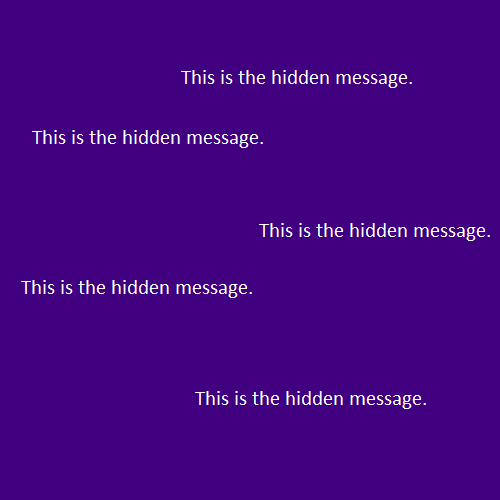
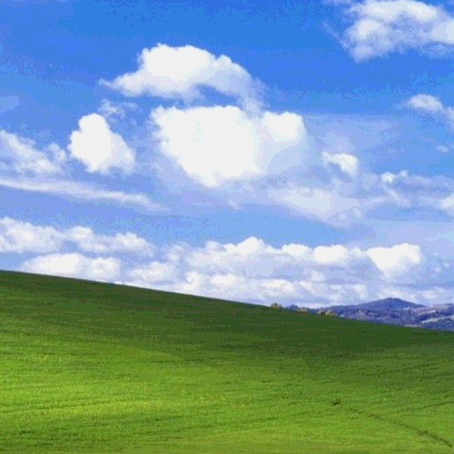

# Steganography

It is the technique of hiding digital data such as audio/image/video within an ordinary, simple, non-secret file such as audio/image/video in order to avoid detection. See [here](#output) for the result.

## About the Project

This is a simple implementation of Image Steganography using the **LSB** (Least Significant Bit) technique. Implemented using MATLAB. This project includes two implementations:

- [Img-to-Img](Img-to-Img): to conceal an image inside of another image.
- [Text-to-Img](Text-to-Img): to conceal plain text inside of an image.

### Img-to-Img

To conceal an image inside of another image. This process involves two images as input. One, _message_ image which will get concealed/hidden, and two, _foreground_ image, the image into which the _message_ image will be concealed. This process generates a new _output_ image.

- **Concealing process**: We know that the value of any number depends on its most significant digit, therefore altering the least significant digit would not change its value by any significant amount. We use this concept to implement image steganography. Every pixel in an image consists of a value between 0-255. This value can be represented as a 8-bit binary number. The most significant bit (MSBs) of the _message_ as well as _foreground_ image are extracted first. Now a new image (_output_) is created in which the MSBs are inserted from the _foreground_ image and LSBs (least significant bits) are inserted from the _message_ image. This is the _output_ image. Since LSBs do not contribute much to the total value of a number, the final output image that we visually see is mostly from the _foreground_ image.

- **Extraction**: The extraction process is much simpler. It involves grabbing the LSBs of the _output_ image and generating a new image with these LSBs as the MSBs of the new image. The LSBs for this new image are substituted as 0s since they do not contribute much into the pixel values. We do not see much of a difference in the extracted new image, rather some dullness in the color. That is how the _message_ image is extracted from the _output_ image.

### Text-to-Img

To conceal plain text inside an image. This process involves only one image (say _cover_ image) and some plain text as input. The user is prompted to input the text to be hidden, and a secret key. This text data is then stored into the image along with the secret key.

- **Concealing process**: First the text along with the secret key are concatenated into a single string and then converted into a stream of bits. These bits will replace the _last bit_ of the pixels in the _cover_ image. All the pixels in the image are not modified, only some of them are.

- **Extraction**: Extraction is the exact opposite. If the inputted key matches the secret key only then will the hidden text be displayed to the user.
  The _last bits_ from the corresponding pixels that were modified are extracted and again a stream of bits is produced. This stream of bits is then used to extract text from it. This is the extraction process.

---

## File Description

### Img-to-Img

- [stegano_img.m](Img-to-Img/stegano_img.m): Run this file to conceal an image into another. Make sure the foreground and message images are of the same dimensions (_foreground.png_ and _message.png_ added inside Img-to-Img directory for reference). This file generates a new image file as an output.

- [decrypt_img.m](Img-to-Img/decrypt_img.m): Run this file to obtain the concealed image from the image generated by _stegano_img.m_.

### Text-to-Img

- [stegano_text.m](Text-to-Img/stegano_text.m): Run this file to conceal plain text into an image (_cover.png_ added inside Text-to-Img directory for reference). This file generates a new image file as an output.

- [decrypt_text.m](Text-to-Img/decrypt_text.m): Run this file to extract concealed text from the image generated by _stegano_text.m_.

- [b2d.m](Text-to-Img/b2d.m) and [d2b.m](Text-to-Img/d2b.m): (helper files) custom Binary-to-Decimal and Decimal-to-Binary converters respectively.

- [get_char.m](Text-to-Img/get_char.m): (helper file) Produces a character from a stream of 8 bits.

- [put_to_img.m](Text-to-Img/put_to_img.m): (helper file) Modifies the last bit of a given integer by replacing it with the bit from a given stream of bits.

---

## Output

### Img-to-Img

As you can see there is no much difference between the foreground image and output image, except that the output image looks a bit distorted. The output image is the result of concealing the message image inside the foreground image.

- foreground image
- message image
- output image

## Other links

Click [here](https://prtvi.github.io/allprojects.html) to check out my other projects

